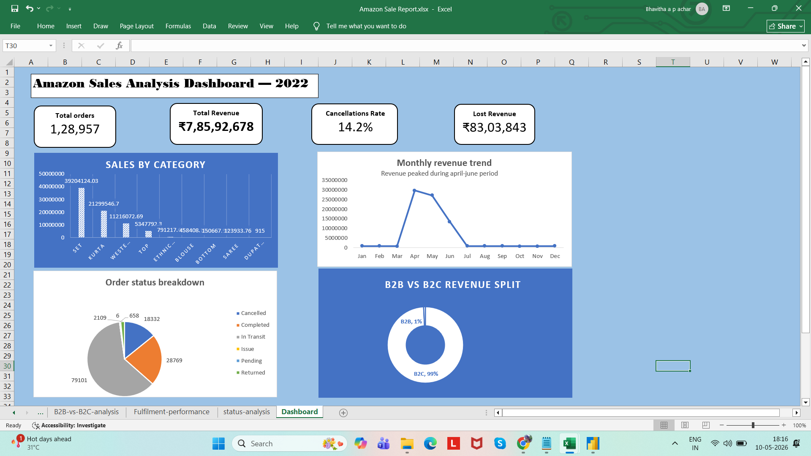

# Amazon Sales Data Analysis (2022)

## Objective
To analyze Amazon sales data and identify key trends, revenue drivers, and operational issues.

## Tools Used
- Excel

## Analysis Performed
- Sales by category
- Monthly revenue trends
- B2B vs B2C analysis
- Fulfilment analysis
- Order status and cancellation analysis

## Key Insights
- Set and Kurta category contributed 77% of total revenue
- Sales between April–June contributed 89.5% of annual revenue
- B2C customers accounted for 99.25% of business
- Amazon fulfilment contributed 69% of revenue
- Cancellation rate was 14.2%, nearly 2x industry benchmark

## Conclusion
The analysis identified major revenue drivers and operational issues affecting business performance and profitability.
## Dashboard Preview

